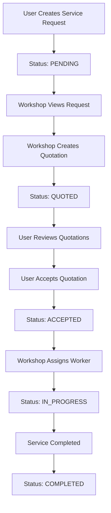

# RoadGuard Backend API

## Overview

A comprehensive backend system for the RoadGuard service booking platform. This API provides functionality for:

- **User Authentication & Authorization** (Multiple user roles)
- **Workshop Management** (Registration, location-based search)
- **Service Request Management** (Create, track, assign services)
- **Quotation System** (Workshop quotes, comparison, acceptance)
- **Worker Management** (Workshop staff, availability tracking)
- **File Upload System** (Service images)

## 🚀 Quick Start

### Prerequisites
- Node.js 18+
- PostgreSQL 12+
- npm or yarn

### Installation

1. **Clone and navigate to backend**
   ```bash
   cd backend
   npm install
   ```

2. **Environment Setup**
   ```bash
   cp .env.example .env
   # Update database credentials and other settings
   ```

3. **Database Setup**
   ```bash
   npm run db:sync
   ```

4. **Start Development Server**
   ```bash
   npm run dev
   ```

The API will be available at `http://localhost:5000`

## 🏗️ Architecture

### Database Schema

#### Core Models
- **User** - Authentication and user profiles (Admin, Workshop Owner, Employee, User)
- **Workshop** - Service provider locations and details
- **ServiceRequest** - User service requests with location and requirements
- **Quotation** - Workshop pricing proposals for service requests
- **Worker** - Workshop employees with specializations and availability
- **Review** - User feedback for workshops

#### Key Features
- **Role-based Access Control** (RBAC)
- **Geolocation Support** for workshops and service requests
- **File Upload** system for service images
- **Real-time Status Tracking** for service requests
- **Multi-quotation System** for competitive pricing

### API Structure

```
/auth                 - Authentication endpoints
/workshops           - Workshop management
/service-requests    - Service booking system
/quotations         - Pricing and quotes
/workers            - Workforce management
/upload             - File upload endpoints
```

## 📊 Service Request Workflow



## 🔐 Authentication

### User Roles
- **ADMIN** - System administration
- **MECHANIC_OWNER** - Workshop owners
- **MECHANIC_EMPLOYEE** - Workshop staff
- **USER** - Regular users

### JWT Token Authentication
All protected endpoints require:
```
Authorization: Bearer <jwt-token>
```

## 🌍 Geolocation Features

- **Workshop Discovery** - Find nearby workshops
- **Service Location** - Precise service delivery locations
- **Worker Tracking** - Real-time worker location updates
- **Distance-based Search** - Radius-based workshop filtering

## 📁 File Upload System

- **Image Upload** for service requests
- **Multiple File Support** (up to 5 images)
- **File Type Validation** (images only)
- **Size Limits** (5MB per file)
- **Static File Serving** at `/uploads/service-images/`

## 🔧 API Endpoints

### Authentication
- `POST /auth/register` - User registration
- `POST /auth/login` - User login
- `POST /auth/verify-otp` - OTP verification
- `GET /auth/profile` - Get user profile

### Service Requests
- `POST /service-requests` - Create service request
- `GET /service-requests` - List service requests (role-filtered)
- `GET /service-requests/:id` - Get service request details
- `PATCH /service-requests/:id` - Update service request

### Quotations
- `POST /quotations/service-request/:id` - Create quotation
- `GET /quotations/service-request/:id` - Get quotations for request
- `POST /quotations/:id/accept` - Accept quotation
- `GET /quotations/workshop/my-quotations` - Workshop quotations

### File Upload
- `POST /upload/image` - Single image upload
- `POST /upload/images` - Multiple image upload

## 🧪 Testing

### Manual API Testing
```bash
# Make the test script executable (Linux/Mac)
chmod +x test-api.sh

# Run the test script
./test-api.sh
```

### Test with curl
```bash
# Health check
curl http://localhost:5000/

# Register user
curl -X POST http://localhost:5000/auth/register \
  -H "Content-Type: application/json" \
  -d '{"name":"John Doe","email":"john@example.com","phone":"1234567890","password":"password123"}'
```

## 📚 Documentation

- **API_DOCUMENTATION.md** - Complete API reference
- **Database Schema** - All models and relationships
- **Response Formats** - Standardized API responses
- **Error Codes** - HTTP status codes and error handling

## 🏃 Development

### Available Scripts
- `npm run dev` - Start development server
- `npm run build` - Build production bundle
- `npm run start` - Start production server
- `npm run db:sync` - Sync database schema
- `npm run type-check` - TypeScript type checking

### Database Management
```bash
# Sync database (development)
npm run db:sync

# Build and sync (production)
npm run db:sync:build
```

## 🌟 Key Features Implemented

### ✅ Core Features
- [x] User Authentication & Role Management
- [x] Workshop Registration & Discovery
- [x] Service Request Creation & Management
- [x] Multi-Quotation System
- [x] Worker Management
- [x] File Upload System
- [x] Geolocation Support
- [x] Status Tracking

### 🔄 Service Flow
1. **User Request** - Create service request with location and details
2. **Workshop Discovery** - System notifies nearby workshops
3. **Quotation Process** - Workshops provide competitive quotes
4. **Selection** - User compares and accepts preferred quotation
5. **Assignment** - Workshop assigns available worker
6. **Tracking** - Real-time status updates throughout service
7. **Completion** - Service completion and feedback

### 📱 Ready for Frontend Integration
- RESTful API design
- Standardized response formats
- Comprehensive error handling
- File upload support
- Real-time status updates
- Mobile-friendly endpoints

## 🔜 Next Steps for Frontend
1. Implement authentication flow
2. Create service request forms
3. Build quotation comparison interface
4. Add real-time status tracking
5. Implement file upload UI
6. Add geolocation features

## 🤝 Integration Notes

The backend is now fully prepared for the frontend implementation. All major features for the service booking workflow are implemented and tested. The API follows REST conventions and provides comprehensive data for building the user interfaces shown in your designs.

Key integration points:
- Authentication tokens for session management
- Geolocation data for map integration
- File upload endpoints for image handling
- Real-time status updates for service tracking
- Role-based data filtering for different user types
